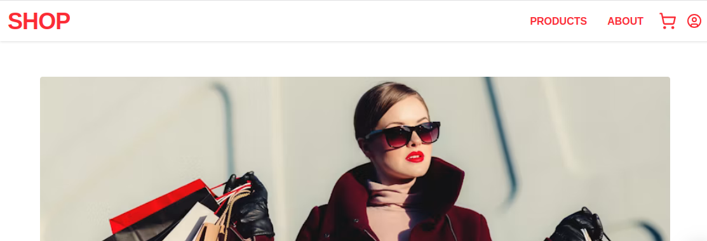

# Tshirt Shop

Interface web para um ecommerce com autenticação de usuários.




## Live Demo


<a href="https://shop-xi-sage.vercel.app/" target="_blank" rel="noopener noreferrer">
  🔗 Acessar a Loja
</a>

## Getting Started

### Requirements

- Vscode
- Node
- Next

### Installation

```bash
git clone https://github.com/code043/shop.git
cd shop
npm install
npm run dev
```

## Resources

### VSCode

- **Install:** https://code.visualstudio.com/download
- **Repository:** https://github.com/microsoft/vscode

### Node

- **Install:** https://nodejs.org/en/download/package-manager/current
- **Repository:** https://github.com/nodejs/node

### Next.js

- **Install:** https://nextjs.org/docs/app/getting-started/installation
- **Repository:** https://github.com/vercel/next.js
